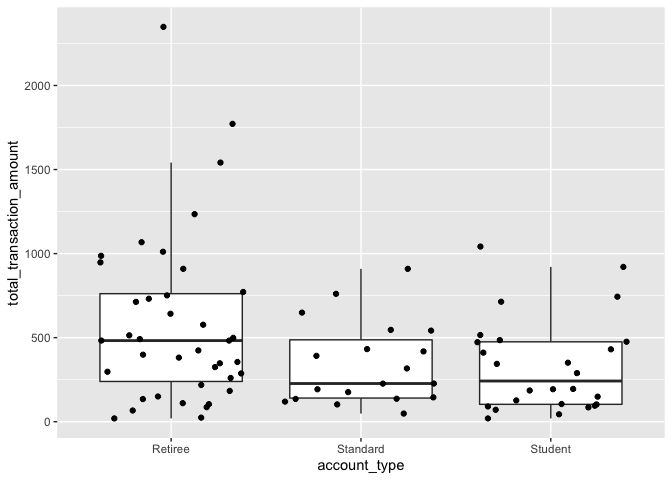
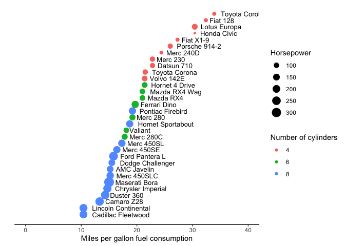

assignment\_6
================
Nicole Szeluga
11/1/2020

Assignment 6: Relational data plus revisiting data wrangling and
visualization ================

## Instructions: Please read through this before you begin

  - This assignment is due by **10pm on Monday 11/02/20**.

  - Please **reproduce this markdown template**. Pay attention to all
    the formating in this file, including bullet points, bolded
    characters, inserted code chunks, headings, text colors, blank
    lines, and etc.

  - For exercise 1, use the appropriate `join` function to **join** some
    relational datasets, and use the resulting datasets to answer some
    questions.

  - For the second exercise in this assignment, you will use the data
    wrangling and visualization skills that you have learned in this
    class to reproduce a figure exactly as it is shown.

  - Have all your code embedded within the R markdown file, and show
    both of your **code** and **plots** in the knitted markdown file.

  - Use R Markdown functionalities to **hide messages and warnings when
    needed**. (Suggestion: messages and warnings can often be
    informative and important, so please examine them carefully and only
    turn them off when you finish the exercise).

  - Please name your R markdown file `assignment_6.Rmd` and the knitted
    markdown file `assignment_6.md`. Please upload both files using your
    personal GitHub repository for this class.

  - First, load all the required packages with the following code.
    Install them if they are not installed yet.

<!-- end list -->

``` r
library(tidyverse)
```

    ## ── Attaching packages ────────────────────────────────────────────────────────────────── tidyverse 1.3.0 ──

    ## ✓ ggplot2 3.3.2     ✓ purrr   0.3.4
    ## ✓ tibble  3.0.3     ✓ dplyr   1.0.2
    ## ✓ tidyr   1.1.2     ✓ stringr 1.4.0
    ## ✓ readr   1.3.1     ✓ forcats 0.5.0

    ## ── Conflicts ───────────────────────────────────────────────────────────────────── tidyverse_conflicts() ──
    ## x dplyr::filter() masks stats::filter()
    ## x dplyr::lag()    masks stats::lag()

``` r
library(knitr)
```

<br>

## Excercise 1: Join functions

**Acknowledgements:** The datasets and some of the questions for this
exercise has been borrowed (with permission) from Iain Carmichael’s
course [STOR 390: Introduction to Data
Science](https://idc9.github.io/stor390/#course_material).

<br>

#### Read in some relational datasets from GitHub

``` r
toy1 <- read_csv('https://raw.githubusercontent.com/idc9/stor390/master/data/joins/toy_one.csv')
```

    ## Parsed with column specification:
    ## cols(
    ##   key = col_character(),
    ##   value = col_character()
    ## )

``` r
toy2 <- read_csv('https://raw.githubusercontent.com/idc9/stor390/master/data/joins/toy_two.csv')
```

    ## Parsed with column specification:
    ## cols(
    ##   label = col_character(),
    ##   animal = col_character()
    ## )

``` r
## for 4.2
play1 <- read_csv('https://raw.githubusercontent.com/idc9/stor390/master/data/joins/play_one.csv')
```

    ## Parsed with column specification:
    ## cols(
    ##   key = col_character(),
    ##   label = col_character(),
    ##   value = col_double()
    ## )

``` r
play2 <- read_csv('https://raw.githubusercontent.com/idc9/stor390/master/data/joins/play_two.csv')
```

    ## Parsed with column specification:
    ## cols(
    ##   key = col_character(),
    ##   label = col_character(),
    ##   othervalue = col_double()
    ## )

``` r
## for 4.3
banking_account_types <- read_csv('https://raw.githubusercontent.com/idc9/stor390/master/data/joins/banking_account_types.csv')
```

    ## Parsed with column specification:
    ## cols(
    ##   account_id = col_character(),
    ##   account_type = col_character()
    ## )

``` r
banking_transactions <- read_csv('https://raw.githubusercontent.com/idc9/stor390/master/data/joins/banking_transactions.csv')
```

    ## Parsed with column specification:
    ## cols(
    ##   id = col_character(),
    ##   transaction_amount = col_double()
    ## )

``` r
## for 4.4
crime_arrests <- read_csv('https://raw.githubusercontent.com/idc9/stor390/master/data/joins/crime_arrests.csv')
```

    ## Parsed with column specification:
    ## cols(
    ##   State = col_character(),
    ##   Murder = col_double(),
    ##   Assault = col_double(),
    ##   UrbanPop = col_double(),
    ##   Rape = col_double()
    ## )

``` r
crime_wealth <- read_csv('https://raw.githubusercontent.com/idc9/stor390/master/data/joins/crime_wealth.csv')
```

    ## Parsed with column specification:
    ## cols(
    ##   Rank = col_double(),
    ##   State = col_character(),
    ##   `2014` = col_double(),
    ##   `2010` = col_double(),
    ##   `2009` = col_double(),
    ##   `2007` = col_double()
    ## )

``` r
## for 4.5
titanic_outcomes <- read_csv('https://raw.githubusercontent.com/idc9/stor390/master/data/joins/titanic_outcomes.csv')
```

    ## Parsed with column specification:
    ## cols(
    ##   PID = col_double(),
    ##   Survived = col_double()
    ## )

``` r
titanic_person_features <- read_csv('https://raw.githubusercontent.com/idc9/stor390/master/data/joins/titanic_person_features.csv')
```

    ## Parsed with column specification:
    ## cols(
    ##   PID = col_double(),
    ##   Name = col_character(),
    ##   PClass = col_character(),
    ##   Age = col_double(),
    ##   Sex = col_character()
    ## )

<br>

#### 1.1 Join the `toy` datasets. Only keep rows that have matches in the other dataset. Show the resulting dataset using `kable()`.

``` r
 rename(toy2,key = label) %>% 
  left_join(toy1, toy2, by = "key") %>% 
  na.omit() %>% 
  kable()
```

| key | animal   | value |
| :-- | :------- | :---- |
| aaa | cat      | this  |
| bbb | dog      | that  |
| bbb | hampster | that  |
| ddd | horse    | thing |
| ddd | horse    | one   |
| aaa | tiger    | this  |

<br>

#### 1.2 Join the `play` datasets by `key` and `label`. Keep all rows from both datasets. Show the resulting dataset using `kable()`.

``` r
full_join(play1, play2, by = c("key", "label")) %>% 
  kable()
```

| key | label | value | othervalue |
| :-- | :---- | ----: | ---------: |
| aaa | rrr   |     1 |        111 |
| aaa | rrr   |     1 |        444 |
| rrr | aaa   |     2 |         NA |
| ttt | xxx   |     3 |        222 |
| vvv | uuu   |     4 |        333 |
| vvv | uuu   |     4 |        555 |
| rrr | aaa   |     6 |         NA |
| ttt | xxx   |     7 |        222 |
| vvv | uuu   |     8 |        333 |
| vvv | uuu   |     8 |        555 |

<br>

#### 1.3 Plot the distribution of total transaction amount per account ID grouped by different account types with a boxplot shown below, using the `banking` datasets.

    ## `summarise()` regrouping output by 'id' (override with `.groups` argument)

``` r
rename(banking_transactions, account_id = id) %>% 
  left_join(banking_account_types, banking_transactions, by = "account_id") %>% 
  group_by(account_id, account_type) %>% 
  summarise("total_transaction_amount" = sum(transaction_amount)) %>% 
  ggplot(mapping = aes( x = account_type, y = total_transaction_amount)) +
  geom_boxplot(outlier.shape = NA) +
  geom_jitter(height=0)
```

    ## `summarise()` regrouping output by 'account_id' (override with `.groups` argument)

<!-- -->

<br>

#### 1.4 Which state is in the `crime_wealth` dataset but not the `crime_arrests` dataset? Use a join function to answer this question.

``` r
left_join( crime_wealth, crime_arrests, by = "State") %>% 
  kable()
```

| Rank | State                |  2014 |  2010 |  2009 |  2007 | Murder | Assault | UrbanPop | Rape |
| ---: | :------------------- | ----: | ----: | ----: | ----: | -----: | ------: | -------: | ---: |
|    1 | Maryland             | 70004 | 69272 | 70545 | 87080 |   11.3 |     300 |       67 | 27.8 |
|    2 | New Jersey           | 69825 | 68342 | 70378 | 84035 |    7.4 |     159 |       89 | 18.8 |
|    3 | California           | 67458 | 67034 | 71595 | 90967 |    9.0 |     276 |       91 | 40.6 |
|    4 | Connecticut          | 65753 | 66953 | 68460 | 81333 |    3.3 |     110 |       77 | 11.1 |
|    5 | District of Columbia | 65124 | 63098 | 57214 | 52746 |     NA |      NA |       NA |   NA |
|    6 | Massachusetts        | 64859 | 62081 | 61401 | 59365 |    4.4 |     149 |       85 | 16.3 |
|    7 | New Hampshire        | 64712 | 63557 | 62731 | 61369 |    2.1 |      57 |       56 |  9.5 |
|    8 | Virginia             | 62881 | 61330 | 58233 | 59562 |    8.5 |     156 |       63 | 20.7 |
|    9 | Hawaii               | 62814 | 59290 | 57936 | 97317 |    5.3 |      46 |       83 | 20.2 |
|   10 | Minnesota            | 61814 | 58931 | 57021 | 59948 |    2.7 |      72 |       66 | 14.9 |
|   11 | Alaska               | 60287 | 69860 | 79989 | 95470 |   10.0 |     263 |       48 | 44.5 |
|   12 | Delaware             | 57954 | 58548 | 60078 | 85591 |    5.9 |     238 |       72 | 15.8 |
|   13 | Washington           | 57835 | 54616 | 52288 | 50082 |    4.0 |     145 |       73 | 26.2 |
|   14 | Wyoming              | 56322 | 55430 | 56993 | 55212 |    6.8 |     161 |       60 | 15.6 |
|   15 | Utah                 | 55869 | 55117 | 56633 | 55109 |    3.2 |     120 |       80 | 22.9 |
|   16 | Colorado             | 55387 | 54659 | 56033 | 53514 |    7.9 |     204 |       78 | 38.7 |
|   17 | New York             | 55246 | 54119 | 55701 | 53914 |   11.1 |     254 |       86 | 26.1 |
|   18 | Rhode Island         | 53636 | 53966 | 56235 | 54124 |    3.4 |     174 |       87 |  8.3 |
|   19 | Illinois             | 53234 | 53341 | 56361 | 55062 |   10.4 |     249 |       83 | 24.0 |
|   20 | Vermont              | 52776 | 52664 | 53207 | 51731 |    2.2 |      48 |       32 | 11.2 |
|   21 | North Dakota         | 51704 | 51618 | 52104 | 49907 |    0.8 |      45 |       44 |  7.3 |
|   22 | Wisconsin            | 50395 | 49993 | 52094 | 50578 |    2.6 |      53 |       66 | 10.8 |
|   23 | Nebraska             | 50296 | 49520 | 50713 | 48576 |    4.3 |     102 |       62 | 16.5 |
|   24 | Pennsylvania         | 50228 | 48745 | 50958 | 49889 |    6.3 |     106 |       72 | 14.9 |
|   25 | Iowa                 | 49427 | 48457 | 50169 | 48730 |    2.2 |      56 |       57 | 11.3 |
|   26 | Texas                | 49392 | 48259 | 50043 | 47548 |   12.7 |     201 |       80 | 25.5 |
|   27 | Kansas               | 48964 | 48044 | 48980 | 47292 |    6.0 |     115 |       66 | 18.0 |
|   28 | Nevada               | 48927 | 47827 | 45685 | 43753 |   12.2 |     252 |       81 | 46.0 |
|   29 | South Dakota         | 48321 | 47817 | 50177 | 47451 |    3.8 |      86 |       45 | 12.8 |
|   30 | Oregon               | 46816 | 47590 | 50861 | 49136 |    4.9 |     159 |       67 | 29.3 |
|   31 | Arizona              | 46709 | 47357 | 49693 | 47085 |    8.1 |     294 |       80 | 31.0 |
|   32 | Indiana              | 46438 | 45734 | 46581 | 45888 |    7.2 |     113 |       65 | 21.0 |
|   33 | Maine                | 46033 | 45424 | 47966 | 47448 |    2.1 |      83 |       51 |  7.8 |
|   34 | Georgia              | 46007 | 45395 | 47988 | 46597 |   17.4 |     211 |       60 | 25.8 |
|   35 | Michigan             | 45981 | 45255 | 48591 | 47950 |   12.1 |     255 |       74 | 35.1 |
|   36 | Ohio                 | 45749 | 45229 | 46867 | 45114 |    7.3 |     120 |       75 | 21.4 |
|   37 | Missouri             | 45247 | 45043 | 46032 | 43424 |    9.0 |     178 |       70 | 28.2 |
|   38 | Florida              | 44299 | 44926 | 47576 | 46253 |   15.4 |     335 |       80 | 31.9 |
|   39 | Montana              | 44222 | 44736 | 47778 | 47804 |    6.0 |     109 |       53 | 16.4 |
|   40 | North Carolina       | 43916 | 43674 | 46549 | 44670 |   13.0 |     337 |       45 | 16.1 |
|   41 | Idaho                | 43341 | 43028 | 43508 | 41452 |    2.6 |     120 |       54 | 14.2 |
|   42 | Oklahoma             | 43225 | 42492 | 43733 | 40926 |    6.6 |     151 |       68 | 20.0 |
|   43 | South Carolina       | 42367 | 42442 | 44625 | 43329 |   14.4 |     279 |       48 | 22.5 |
|   44 | New Mexico           | 41963 | 42322 | 43654 | 43531 |   11.4 |     285 |       70 | 32.1 |
|   45 | Louisiana            | 41734 | 41725 | 43614 | 42367 |   15.4 |     249 |       66 | 22.2 |
|   46 | Tennessee            | 41693 | 41664 | 42822 | 41567 |   13.2 |     188 |       59 | 26.9 |
|   47 | Alabama              | 41415 | 40489 | 42666 | 40554 |   13.2 |     236 |       58 | 21.2 |
|   48 | Kentucky             | 41141 | 40072 | 41538 | 40267 |    9.7 |     109 |       52 | 16.3 |
|   49 | Arkansas             | 38758 | 37823 | 38815 | 38134 |    8.8 |     190 |       50 | 19.5 |
|   50 | West Virginia        | 38482 | 37435 | 37989 | 37060 |    5.7 |      81 |       39 |  9.3 |
|   51 | Mississippi          | 36919 | 36646 | 37790 | 36338 |   16.1 |     259 |       44 | 17.1 |

The answer is the District of Columbia.

<br>

## Exercise 2: Fuel Efficiency of Car Models

This exercise uses the `mtcars` dataset. It was extracted from the 1974
Motor Trend US magazine, and comprises fuel consumption and 10 aspects
of automobile design and performance for 32 automobiles (1973–74
models).

``` r
kable(head(mtcars))
```

|                   |  mpg | cyl | disp |  hp | drat |    wt |  qsec | vs | am | gear | carb |
| :---------------- | ---: | --: | ---: | --: | ---: | ----: | ----: | -: | -: | ---: | ---: |
| Mazda RX4         | 21.0 |   6 |  160 | 110 | 3.90 | 2.620 | 16.46 |  0 |  1 |    4 |    4 |
| Mazda RX4 Wag     | 21.0 |   6 |  160 | 110 | 3.90 | 2.875 | 17.02 |  0 |  1 |    4 |    4 |
| Datsun 710        | 22.8 |   4 |  108 |  93 | 3.85 | 2.320 | 18.61 |  1 |  1 |    4 |    1 |
| Hornet 4 Drive    | 21.4 |   6 |  258 | 110 | 3.08 | 3.215 | 19.44 |  1 |  0 |    3 |    1 |
| Hornet Sportabout | 18.7 |   8 |  360 | 175 | 3.15 | 3.440 | 17.02 |  0 |  0 |    3 |    2 |
| Valiant           | 18.1 |   6 |  225 | 105 | 2.76 | 3.460 | 20.22 |  1 |  0 |    3 |    1 |

<br>

#### 2.1 Reproduce the following plot, which shows the miles per gallon (`mpg`) of car models on the x axis (see hints below). Different models are ordered on the y axis according to their `mpg` and their names are shown next to the data points. Also, the size of each data point maps to its horse power (`hp`), and the color maps to number of cylinders (`cyl`).

``` r
mtcars %>% 
  rownames_to_column() %>% 
  mutate("mpg_order" = row_number(mpg)) %>% 
  ggplot(mapping = aes(x = mpg, y= mpg_order, color = factor(cyl), size = hp)) +
  geom_point() +
  geom_text(aes(label = rowname, hjust = -.15), size = 3.5, color = "black") +
  xlab("Miles per gallon fuel consumption") +
  ylab("") +
  labs(size = "Horsepower", color = "Number of cylinders") +
  theme(axis.line.y = element_blank(), panel.background = element_blank(), axis.line.x = element_line(), axis.ticks.y.left = element_blank(), axis.text.y = element_blank(), legend.key = element_blank()) +
  xlim(0,40) 
```

<!-- -->

<br>
